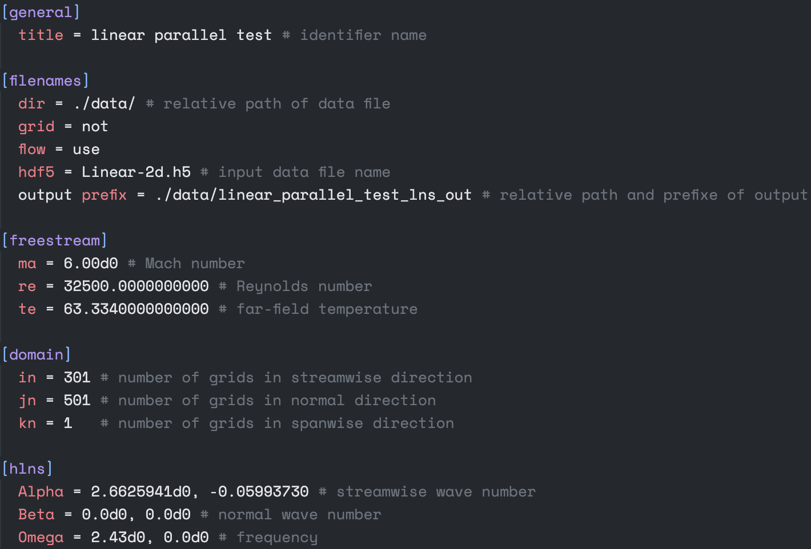
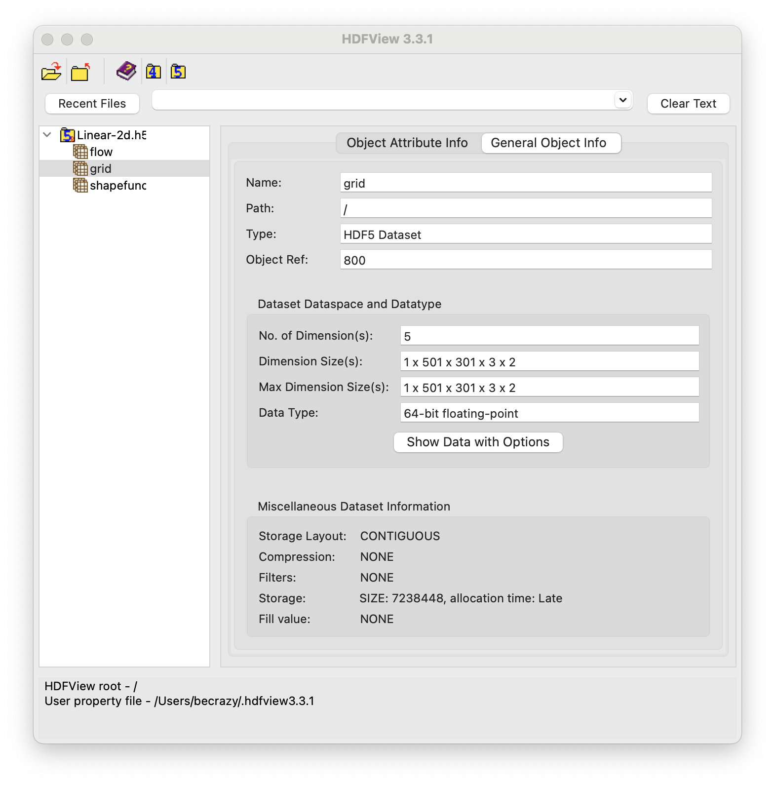
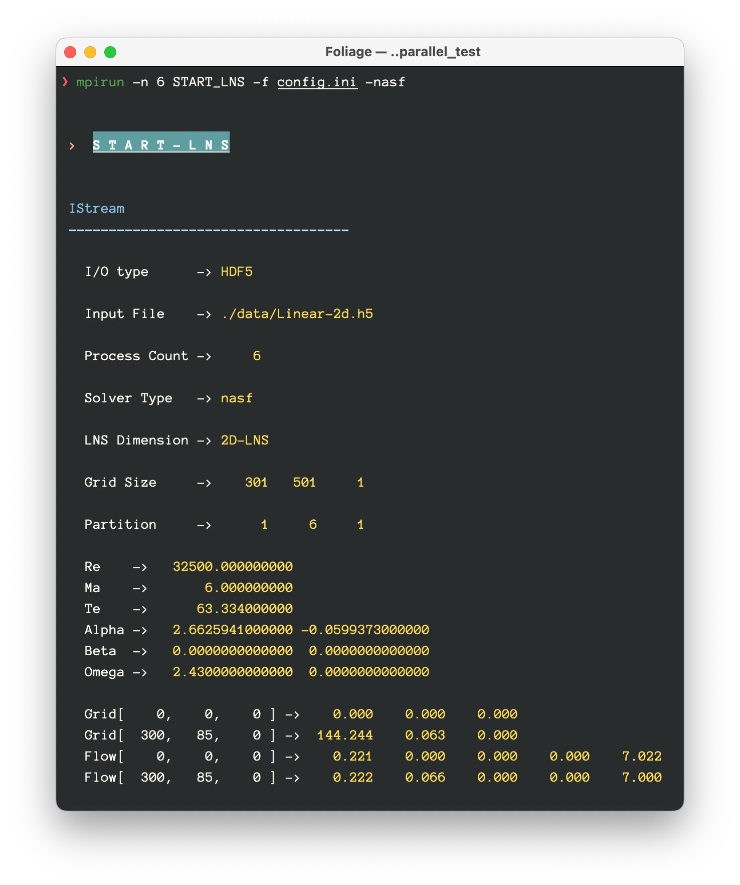
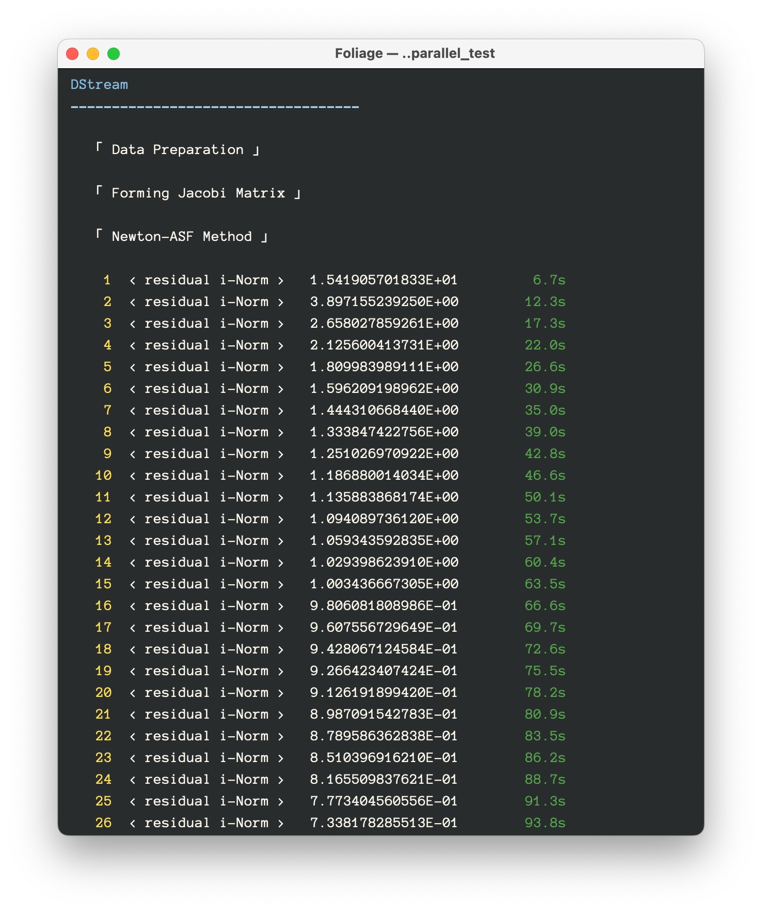
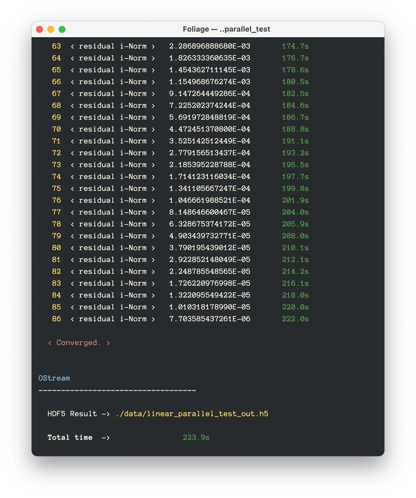
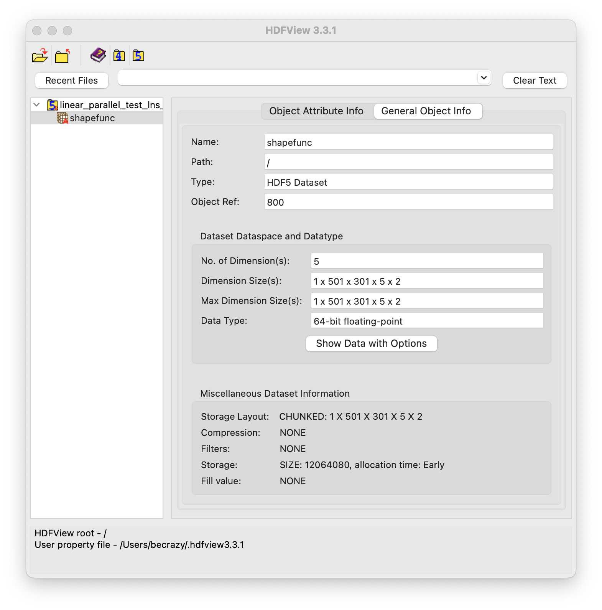

# START_LNS

## Installation
To install the solver, a MPI implementation and a fortran compiler are needed, PETSc has follwing configuration:
```
 ./configure --with-debugging=no --with-scalar-type=complex --with-fortran-bindings=1 --with-precision=double --download-slepc --download-hdf5
```
Once you have these prerequisites installed, you can follow these steps to install the software:
1. Clone the repository to your local machine.
2. Change directories to the project directory:<br>
``` cd START_LNS```
3. Run the make command to build the software:<br>
``` make```
4. Run the make install command to install the software:<br>
``` make install```
5. This will install the software to the `~/bin` directory. You can then run the software by typing the following command in a terminal:<br>
``` START_LNS -f config.ini```

## Usage
The standard MPI startup command, as the START_LNS is the executable file.
	
```> mpirun -n 256 START_LNS -f <config.ini> [-solver_type]```
	
`-f` specifies the configuration file, and optional solver commands `solver_type`: `[-asf,-nasf,-lnasf]` correspond to as-fgmres, nas-fgmres, lnas-fgmres methods respectively, the default value is nas-fgmres.
	
The contents of the parameter file and a description of each item are listed here:



The input file as shown in following figure has three datasets with names: flow, grid, and shapfunc, which correspond to the base flow, grid, and the initial value containing the inlet boundary condition information.



The solver runs with the following interface after console `> mpirun -n 6 START_LNS -f config.ini -asf` :







While the output file contains only the results as follow:



## License

This project is licensed under the GNU Lesser General Public License (LGPL v3). You are free to use, modify, and distribute the code in this project, but you must comply with the terms of the LGPL license.

You can get the text of the LGPL license from the following link: https://www.gnu.org/licenses/lgpl-3.0.html .

